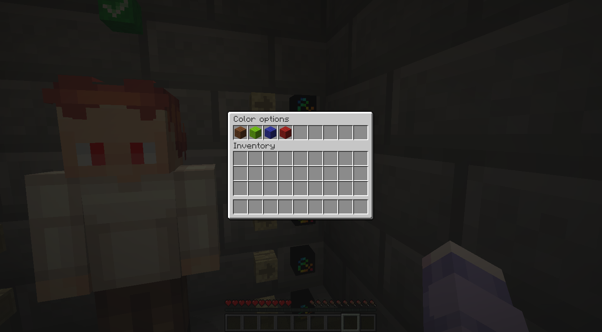

## Creating Skin Customizers using Java
You can instantiate the [`SkinCustomizer`](customizer/SkinCustomizer.java)
class to create a customizer.

**Note: customizers are not persistent! Once the server restarts, they're gone.
So make sure your integration re-creates them if you want them to be persistent!**

Example code to create a customizer:
```java
import dev.jensderuiter.skincustomizer.customizer.SkinCustomizer;

Location location = ...;
SkinCustomizer customizer = new SkinCustomizer(location);
customizer.summon(); // this will actually summon the preview and UI
```

## Custom options
In some scenarios you might want to alter the default options for the skin customizer.

### Filtering categories
For example, only show the eye editor by filtering the categories to only have
the eye category (id = 1).
```java
import dev.jensderuiter.skincustomizer.customizer.SkinCustomizer;
import dev.jensderuiter.skincustomizer.customizer.option.SkinCustomizerOptions;

Location location = ...;

// make sure to clone!!!
SkinCustomizerOptions options = SkinCustomizer.getDefaultOptions().clone();
options.setCategories(
        options.getCategories()
                .stream()
                .filter(category -> category.getCategoryId() == 1).
                .toList()
);
        
SkinCustomizer customizer = new SkinCustomizer(location, options);
```

This will result in:


### Adding color (palettes)
You can also add colors to certain categories.
In this example, we add the color red to the eyes menu
using red wool as the menu item, and #FF0000 as the color.
```java
import dev.jensderuiter.skincustomizer.customizer.SkinCustomizer;
import dev.jensderuiter.skincustomizer.customizer.option.SkinCustomizerOptions;

Location location = ...;

// make sure to clone!!!
SkinCustomizerOptions options = SkinCustomizer.getDefaultOptions().clone();
options.getCategories()
        .stream()
        .filter(category -> category.getCategoryId() == 1)
        .findFirst()
        .ifPresent(category -> category.getColorOptions().add(
                new ColorOption(Material.RED_WOOL, List.of("#FF0000"))
        ));
        
SkinCustomizer customizer = new SkinCustomizer(location, options);
```

This will result in:



## What are all the options?
Check https://api-docs.jensderuiter.dev/skin-generator/ to see what types of
options, components, categories, color palettes etc are available.
This project is based on https://jens.skin, so it's important
to be familiar with its API.
